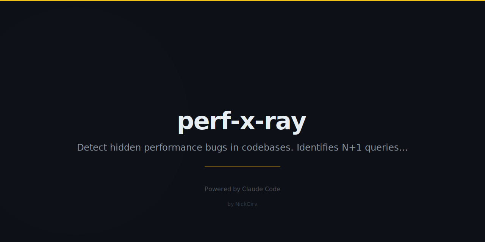

<p align="center">
  
</p>

<p align="center">
  <strong>X-ray your codebase for performance anti-patterns — no browser needed.</strong><br/>
  Static analysis. Zero API keys. Works on JS, TS, Python, Go, and SQL.
</p>

<p align="center">
  
  
  
</p>

---

## Install

```bash
npm install -g perf-x-ray
```

Or run without installing:

```bash
npx perf-x-ray scan ./src
```

---

## Quick Demo

```bash
$ npx perf-x-ray scan ./src

  perf-x-ray scanning /your/project/src ...

  [CRITICAL]  2 issues
  !!! src/api/users.js:42  [n-plus-one]  Database query inside a loop causes N+1 queries.
      > const user = await db.findOne({ where: { id: ids[i] } });
        fix: Batch the IDs, fetch once outside the loop (findMany), then map results.

  !!! src/utils/regex.js:18  [blocking-regex]  Regex with nested quantifiers can backtrack exponentially.
      > const re = /([a-z]+)+@([a-z]+)+\.[a-z]+/gi;
        fix: Rewrite using atomic groups. Test with safe-regex.

  [HIGH]  3 issues
  !! src/routes/posts.js:91  [no-pagination]  API returns all records with no pagination.
  !! src/db/queries.js:14    [unbounded-query]  SELECT without LIMIT can exhaust memory.
  !! src/server.js:7         [sync-io]  Synchronous filesystem call blocks the event loop.

  perf-x-ray  2 critical  |  3 high  |  1 medium  |  0 low  (6 total)

  Top files:
    src/api/users.js   — 3 issues
    src/routes/posts.js — 2 issues
    src/db/queries.js  — 1 issue
```

---

## Commands

### `scan [path]` (default)

Scan a directory recursively for performance issues.

```bash
perf-x-ray scan ./src
perf-x-ray scan .                          # scan current dir
perf-x-ray scan ./src --severity high      # only high + critical
perf-x-ray scan ./src --format json        # JSON output
perf-x-ray scan ./src --ignore dist,build  # skip extra dirs
perf-x-ray scan ./src --fix               # show fix suggestions
```

### `check <file>`

Check a single file.

```bash
perf-x-ray check src/api/users.js
perf-x-ray check src/db.py --severity critical
```

### `report [path]`

Generate a Markdown report file.

```bash
perf-x-ray report ./src
perf-x-ray report ./src --output reports/perf.md
```

### `rules`

List all built-in performance rules.

```bash
perf-x-ray rules
```

---

## Options

| Option | Values | Default | Description |
|--------|--------|---------|-------------|
| `--severity` | low \| medium \| high \| critical | low | Minimum severity to report |
| `--format` | text \| json \| markdown | text | Output format |
| `--ignore` | comma-separated names | — | Extra dirs/files to skip |
| `--fix` | flag | false | Show fix suggestions inline |
| `--output` | file path | perf-xray-report.md | Report output file (report cmd only) |

---

## Rules

| ID | Name | Severity | Languages |
|----|------|----------|-----------|
| `sync-io` | Synchronous I/O in Async Context | high | JS, TS |
| `n-plus-one` | N+1 Query Pattern | **critical** | JS, TS, Python, Go |
| `unbounded-query` | Unbounded SQL Query | high | JS, TS, Python, Go, SQL |
| `large-import` | Large Barrel Import | medium | JS, TS |
| `missing-memo` | Expensive React Render Without Memoisation | medium | JS, TS |
| `console-in-prod` | console.log in Production Code | low | JS, TS |
| `nested-loops` | Nested Iteration — O(n²) Complexity | high | JS, TS, Python, Go |
| `no-pagination` | API Endpoint Without Pagination | high | JS, TS, Python |
| `blocking-regex` | Catastrophic Regex Backtracking | **critical** | JS, TS, Python, Go |
| `missing-index-hint` | Filter on Likely Unindexed Column | medium | JS, TS, Python, Go, SQL |

---

## Features

- **Zero config** — runs out of the box, no setup required
- **Zero API keys** — fully offline, pure static analysis
- **Multi-language** — JavaScript, TypeScript, Python, Go, SQL
- **10 rules** covering the most expensive runtime perf bugs
- **CI-friendly** — exits with code 1 when issues are found
- **Three output formats** — text (colored), JSON, Markdown report
- **Smart file walking** — auto-skips `node_modules`, `dist`, `.git`, `__pycache__`, `vendor`

---

## Use in CI

```yaml
- name: Perf X-Ray
  run: npx perf-x-ray scan ./src --severity high --format json > perf-report.json
```

Exit code `1` when findings exist, `0` when clean — integrates naturally with any CI pipeline.

---

## Programmatic API

```js
import { walkFiles, checkFiles, formatFindings } from 'perf-x-ray';
import { readFileSync } from 'fs';

const files = walkFiles('./src');
const findings = checkFiles(files, (fp) => readFileSync(fp, 'utf8'));
const output = formatFindings(findings, 'json');
```

---

## License

MIT — Copyright (c) 2026 [NickCirv](https://github.com/NickCirv)
