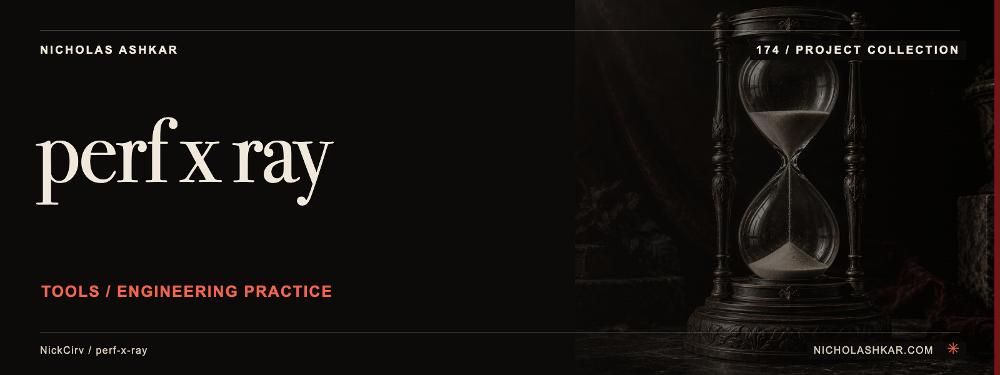

# perf-x-ray

Find source patterns that may deserve performance review before profiling an application.

Scans supported source files with language-specific regex rules, filters findings by severity and generates text, JSON or Markdown reports.


<a id="install"></a>

## Quickstart

Package runtime requirement: Node.js `>=20`. Git is needed to obtain this pinned source checkout.

```bash
git clone https://github.com/NickCirv/perf-x-ray.git
cd perf-x-ray
git checkout aa92ada0849b48b472a95c524341d92e136e78be
npm install --ignore-scripts
node bin/xray.js rules
```

This source-derived example has not been executed in this review. The command lists the shipped rule catalog. A scan reports matched patterns rather than measured timing.


<a id="what-it-does"></a>

## Usage

```bash
node bin/xray.js scan ./src --severity high --format json
node bin/xray.js check src/example.js --fix
node bin/xray.js report ./src --output perf-review.md
```

Scan/check exit 1 when filtered findings remain. A single-file read failure exits 2. `--fix` includes suggestions; it does not rewrite source. `report` writes Markdown.

[Command reference](docs/REFERENCE.md) covers arguments, modes and output controls.

## Behavior and limits

A matched synchronous call or loop is not proof of a bottleneck. The checks do not execute code, use a browser or capture traces; false positives and missed cases are expected. Measure a suspected problem before changing implementation.

## Development

Declared package scripts:

| Script | Command |
| --- | --- |
| `start` | `node bin/xray.js` |
| `lint` | `node --check src/*.js bin/xray.js` |
| `test` | `node --test` |

The smoke test syntax-checks the entrypoint; it does not exercise CLI behavior or integrations.

## Research

[Source review and claim ledger](docs/RESEARCH.md) records revision `aa92ada0849b`, inspected files and verification gaps.

## License and attribution

Protected license and attribution files remain unchanged: [LICENSE](https://github.com/NickCirv/perf-x-ray/blob/aa92ada0849b48b472a95c524341d92e136e78be/LICENSE).

[Artwork credits](assets/nicholas-ashkar/CREDITS.md) · [Nicholas Ashkar — consulting](https://nicholashkar.com/#oxblood-contact)
